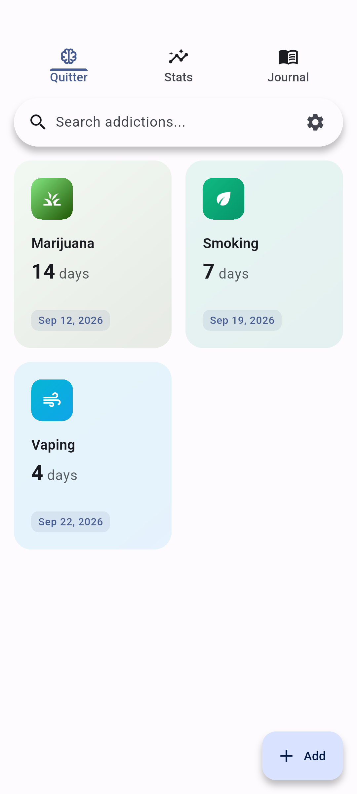
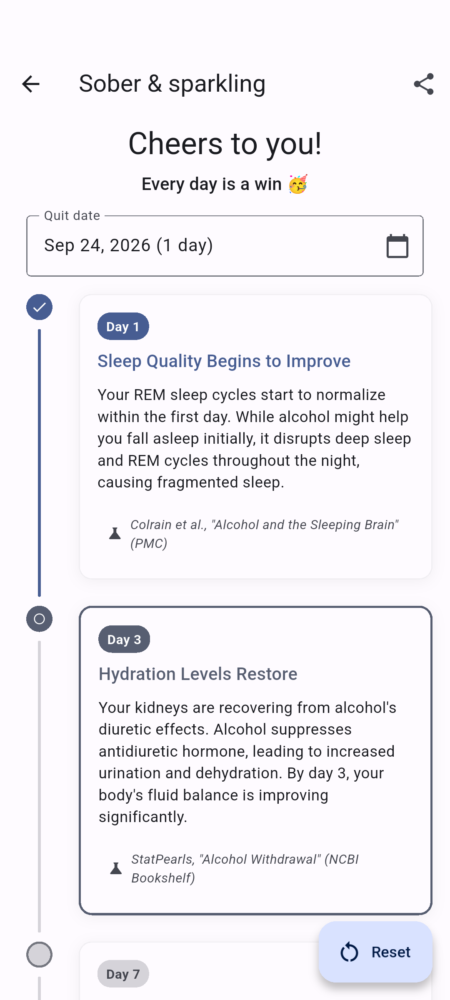
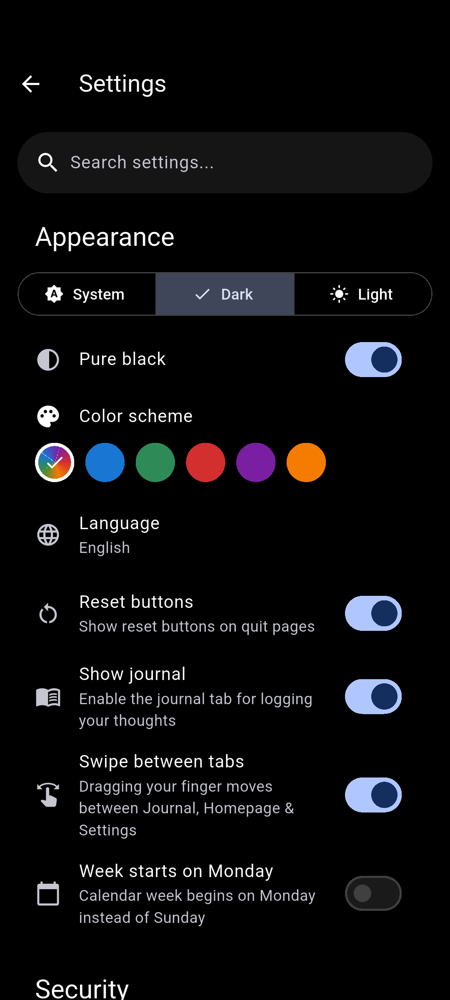
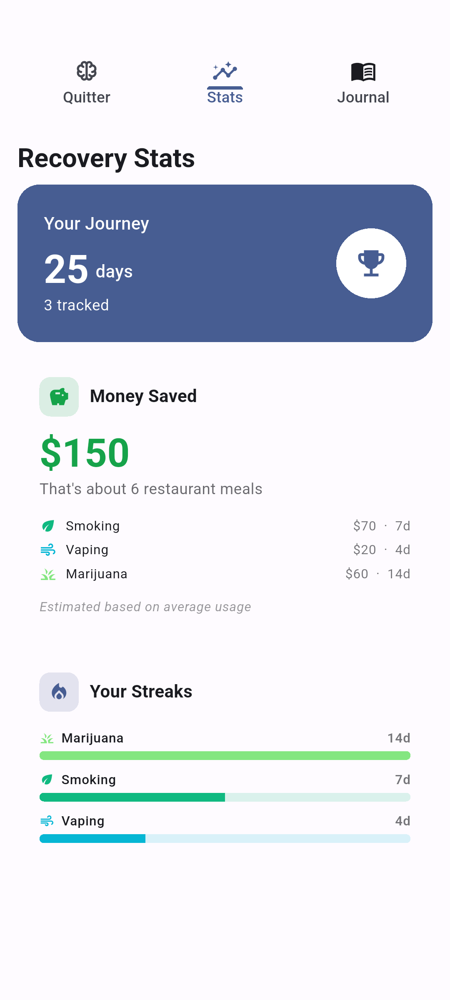
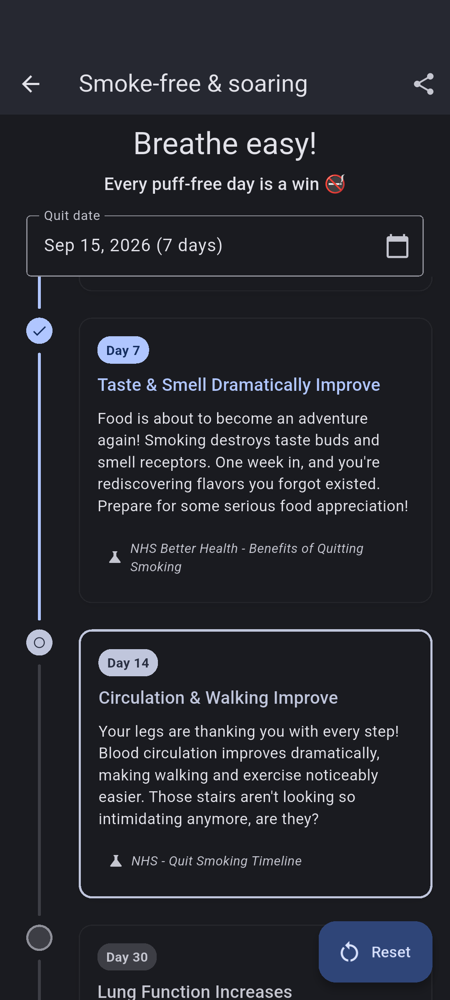
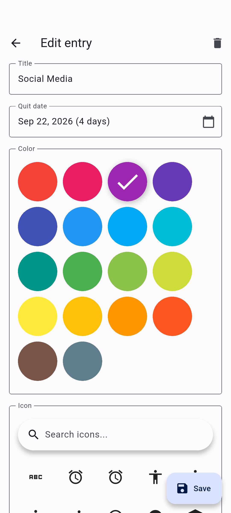
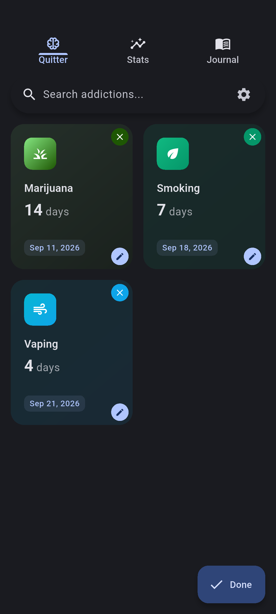
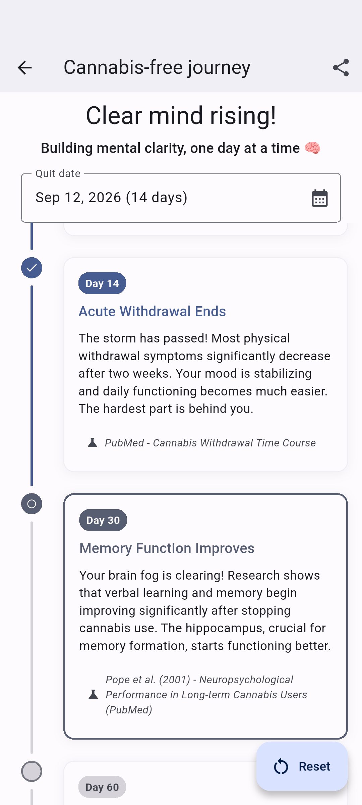

<div align="center">


# Quitter

**Track your quitting journey without turning it into someone else's data.**

A free and open-source quit tracker built around local data, useful milestones, and a calm interface.

<p>
  <a href="https://github.com/brandonp2412/Quitter/releases/latest"></a>
  <a href="https://github.com/brandonp2412/Quitter/releases"></a>
  <a href="LICENSE.md"></a>
</p>

<p>
  <a href="https://f-droid.org/en/packages/com.quitter.app/"></a>
  <a href="https://play.google.com/store/apps/details?id=com.quitter.app"></a>
  <a href="https://apps.microsoft.com/detail/9PKVZWDG3FGC?referrer=appbadge&mode=direct"></a>
  <a href="https://brandonp2412.github.io/Quitter/"></a>
</p>

<sub>No tracking · Local data · Multiple journeys · Fully customisable</sub>

</div>

## See your progress, not a dashboard full of noise

<p align="center">
  
  
  <br><br>
  
  
</p>

<details>
<summary>More screenshots</summary>
<br>

<p align="center">
  
  
  <br><br>
  
  
</p>
</details>

## Built for the journey

**Private by design.** Quitter doesn't track you. Your progress is stored locally instead of being sent to an account or analytics service.

**More than one goal.** Track multiple habits at once, follow milestones, journal how things are going, and get progress notifications when you want them.

**Make it yours.** Choose colours and themes, create custom entries, and turn features on or off so the app stays focused on what matters to you.

## Help translate Quitter

Translations are managed on [Crowdin](https://crowdin.com/project/quitter). Contributions for any supported language are welcome.

<a href="https://crowdin.com/project/quitter"></a>

## Development

<details>
<summary>Run Quitter locally</summary>
<br>

Quitter is built with Flutter.

```bash
git clone --recursive https://github.com/brandonp2412/Quitter.git quitter
cd quitter
flutter pub get
flutter run
```

</details>

## License

Quitter is available under the [MIT License](LICENSE.md).
