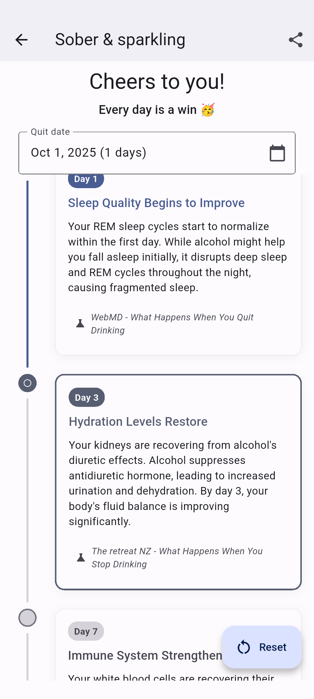
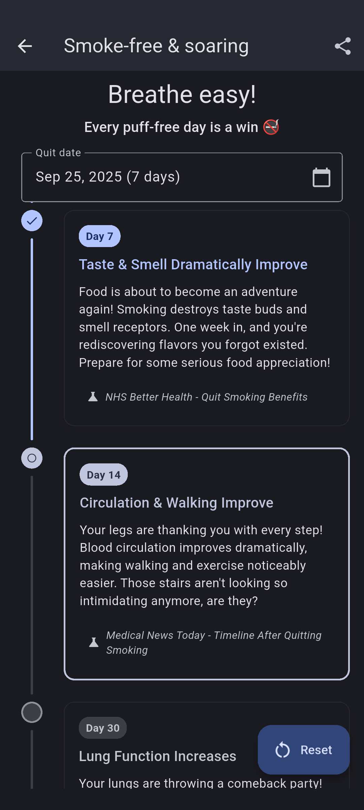
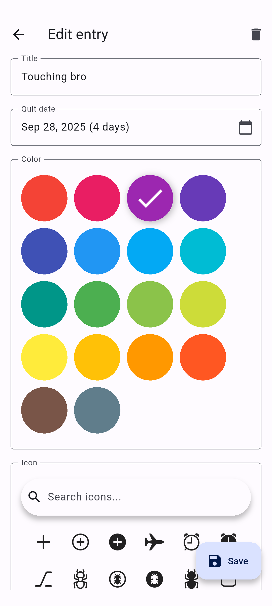
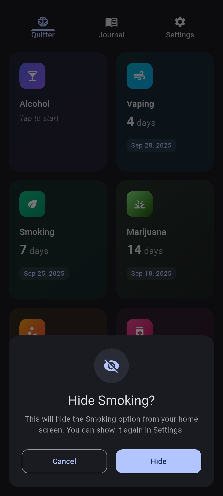
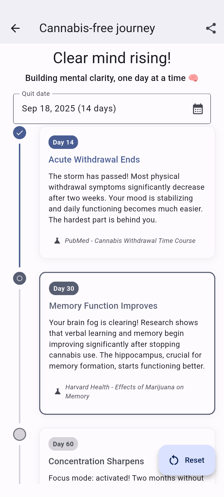
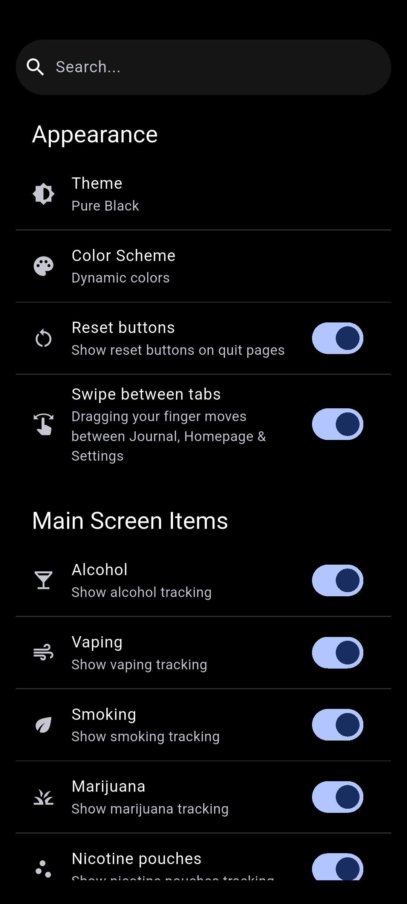
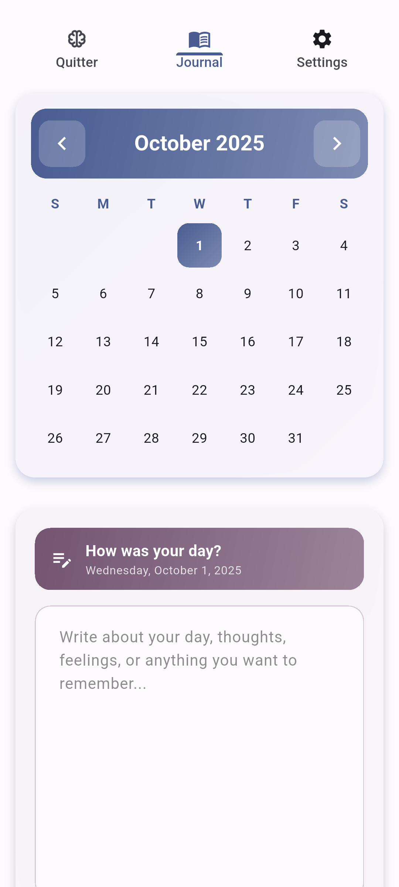

# Quitter

Record your quitting journey with a Free and Open Source app.

<p float="left">
    <a href="https://github.com/brandonp2412/Quitter/releases/latest"></a>
    <a href="https://shields.io/badges/git-hub-downloads-all-assets-all-releases"></a>
</p>

## Features

*   🕵️ **No tracking** We don't save any of your user data. Everything is stored locally.
*   🌍 **No internet** Our app doesn't request internet access, at all.
*   🚀 **Multiple journeys** Monitor progress for different habits simultaneously.
*   🎯 **Milestone tracking** Record and celebrate key achievements in your quitting journey.
*   📔 **Journaling** Write your thoughts and feelings as you progress.
*   🔔 **Notifications** Be encouraged with progress notifications.
*   ⚙️ **Completely custom** Toggle features on/off, change colors & themes with settings.

<a href='https://play.google.com/store/apps/details?id=com.quitter.app'></a>
<a href='https://brandonp2412.github.io/Quitter/'></a>

# Screenshots

<p class="float-left">
    
    
    
    
    
    
    
    
</p>

# Getting Started

These instructions will get you a copy of the project up and running on your local machine for development and testing purposes.

## Prerequisites

This project is built with Flutter. Ensure you have Flutter installed on your system. If not, follow the official Flutter installation guide: [https://flutter.dev/docs/get-started/install](https://flutter.dev/docs/get-started/install)

## Installation

1.  **Clone the repository:**
    ```bash
    git clone https://github.com/brandonp2412/Quitter.git quitter
    cd quitter
    ```

2.  **Get Flutter dependencies:**
    ```bash
    flutter pub get
    ```

## Running the App

To run the app on a connected device or emulator:

```bash
flutter run
```