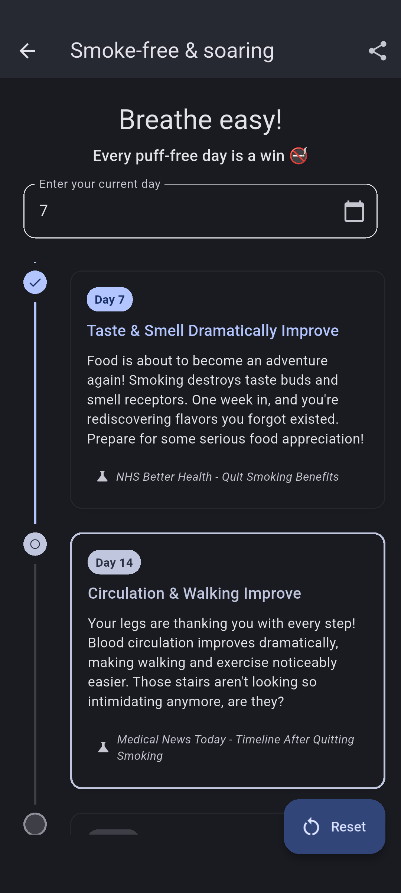
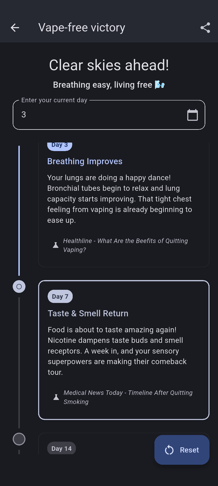
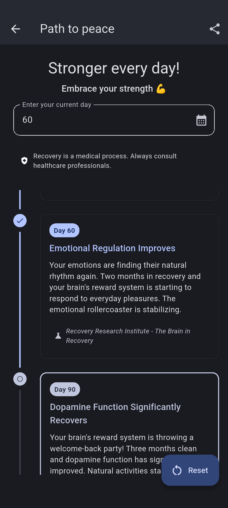

# Quitter

Record your quitting journey with a Free and Open Source app.

<p float="left">
    <a href="https://github.com/brandonp2412/Quitter/releases/latest"></a>
    <a href="#"></a>
</p>

## Features

*   **Track Multiple Quitting Journeys:** Monitor progress for different habits simultaneously.
*   **Milestone Tracking:** Record and celebrate key achievements in your quitting journey.
*   **User-Friendly Interface:** Clean and intuitive design for easy navigation.
*   **Open Source:** Transparent and community-driven development.

<a href='https://play.google.com/store/apps/details?id=com.quitter.app'></a>

<p class="float-left">
    
    
    
    
    
    
</p>

## About

Quitter makes it easy to remember how long it's been since you've dropped a bad habit.
Automatically calculate the # of days since your quit date, and see beautiful infographics
on your quitting journey.

## Getting Started

These instructions will get you a copy of the project up and running on your local machine for development and testing purposes.

### Prerequisites

This project is built with Flutter. Ensure you have Flutter installed on your system. If not, follow the official Flutter installation guide: [https://flutter.dev/docs/get-started/install](https://flutter.dev/docs/get-started/install)

### Installation

1.  **Clone the repository:**
    ```bash
    git clone https://github.com/brandonp2412/quitter.git
    cd quitter
    ```

2.  **Get Flutter dependencies:**
    ```bash
    flutter pub get
    ```

### Running the App

To run the app on a connected device or emulator:

```bash
flutter run
```

## Contributing

We welcome contributions! If you'd like to contribute, please follow these steps:

1.  Fork the repository.
2.  Create a new branch (`git checkout -b feature/your-feature-name`).
3.  Make your changes.
4.  Commit your changes (`git commit -m 'Add some feature'`).
5.  Push to the branch (`git push origin feature/your-feature-name`).
6.  Open a Pull Request.

Please ensure your code adheres to the project's coding style and includes appropriate tests.

## License

This project is licensed under the MIT License - see the `LICENSE` file for details.
